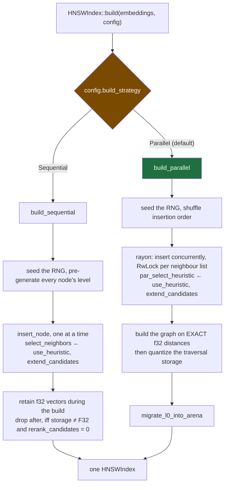
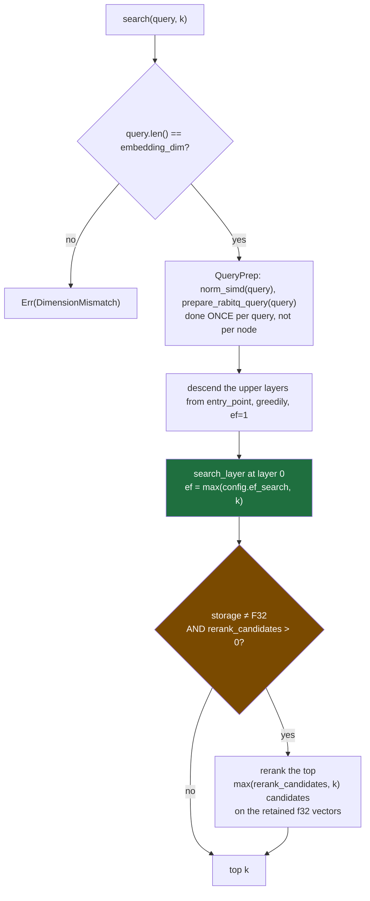
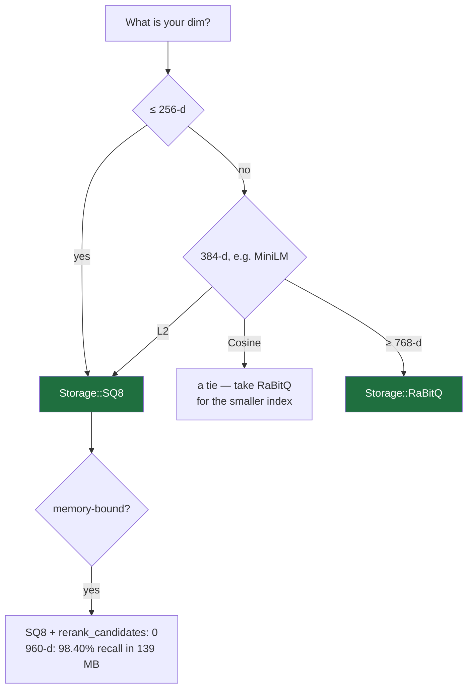

# foxstash — how it actually runs

Diagrams of the real control flow, drawn against the source, plus the checks that keep them honest.

> **Why this file is dangerous, and what stops it.**
>
> The 1.0 audit found sixteen bugs. Nearly all were the same shape: **knowledge in a form that
> could not fail.** A correct comment above wrong code. A rustdoc promising reproducibility the
> builder does not deliver. A test that ran an option without being able to tell whether it worked.
> The knowledge was *present*; it just never became an assertion.
>
> A diagram is that same species. It is a comment with boxes, and it rots exactly the way a comment
> rots — except a diagram rots *authoritatively*, because people trust pictures.
>
> So the load-bearing diagram here — [the config matrix](#1-which-option-reaches-which-path) — is
> **generated from the source** and fails CI. The rest are hand-drawn, and each names the test that
> pins it. If a hand-drawn diagram below disagrees with the code, the code is right and this file
> is a bug.

---

## 1. Which option reaches which path

**Generated. Do not edit.** `python3 xtask/config_matrix.py`

```
config field                          build  build:Sequential    build:Parallel               add            search
-------------------------------------------------------------------------------------------------------------------
metric                                 read              read              read              read              read
m                                      read              read              read              read              read
m0                                     read              read              read              read              read
ef_construction                        read              read              read              read              read
ef_search                                 .                 .                 .                 .              read
ml                                     read              read              read              read              read
use_heuristic                          read              read              read              read              read
extend_candidates                      read              read              read              read              read
keep_pruned_connections                read              read              read              read              read
build_strategy                         read                 .                 .                 .                 .
seed                                   read              read              read              read              read
storage                                read              read              read              read              read
rerank_candidates                      read              read              read              read              read
turbo_bits                             read              read              read              read              read
rabit_bits                             read              read              read              read              read
```

**An empty cell is a bug report.** Every builder bug in the audit has exactly this signature — a
field with zero reads anywhere in an entry point's call subtree, while its docs promise it applies
there:

| bug | the empty cell |
|---|---|
| parallel builder used the array-capacity constants, not your degree | `m` × `build:Parallel` |
| parallel builder never received the selection flags | `use_heuristic` × everything |
| " | `extend_candidates` × everything |
| `random_level` called `rand::rng()` per insert, ignoring the seed | `seed` × `add` |

The last one was found *by this table*, after the first three were fixed by hand.

The tool over-approximates reachability (it cannot resolve a call to one of three functions named
`search` without type inference). That can only ever **hide** a missing read — so **an empty cell is
trustworthy, and a `read` cell is merely probable.** It is validated against `9aa7def`, where it
must still independently rediscover the three cells known to be empty there.

---

## 2. Build

Two builders. They must agree on every option, and the whole audit is the story of them not doing so.



**The graph is always built on exact f32 distances**, under every storage mode. Quantization applies
to *traversal*, afterwards. An exact graph is strictly better than one built on lossy codes, and
`points` is right there during the build — this is why `Storage::RaBitQ` reaches 98% recall while the
deleted `PQHNSWIndex`, which traversed *on* PQ codes, was stuck at a ~62% structural ceiling.

### Where the two builders genuinely differ

| | `Parallel` (default) | `Sequential` |
|---|---|---|
| speed at 1M | **5.2x faster** | — |
| recall cost | 0.02–0.31 points | — |
| **reproducible at a fixed `seed`** | **no** | **yes** |

The parallel builder is **not reproducible even at a fixed seed**: threads race for the lock on each
neighbour list, so two builds of an identical config differ on ~78% of nodes (measured, m0=16,
n=600). The seed fixes level assignment and insertion order, not the interleaving.

Recall is unaffected — each such graph is a valid HNSW. What you lose is byte-identical indexes.
If you need those, set `BuildStrategy::Sequential` as well as `seed`.

> This cost me a test. The first `use_heuristic` test compared the graph built with the option on
> against the graph with it off and asserted they differed — and passed under sabotage, because two
> *identical* builds already differ by 78%. It was measuring the race. **A difference smaller than
> the noise is not evidence.** The test now measures average layer-0 degree, averaged over builds,
> against a noise floor measured on that same statistic.
>
> Pinned by `use_heuristic_and_extend_candidates_are_honoured_by_both_builders` and
> `seed_gives_reproducible_builds_only_on_the_sequential_builder`.

---

## 3. Search



`ef_search` is the recall/speed dial and the **only** option read exclusively on this path.

**Reranking cannot rescue what the walk never retrieved.** It reorders the candidate pool; it does
not enlarge the set of items reachable through the graph. This is the whole reason `PQHNSWIndex`
died: widening its pool from 100 to 400 made recall *fall*.

`rerank_candidates: 0` means the f32 vectors are dropped after the build. That is a real
configuration, not a degenerate one — at 960-d, **SQ8 with no reranking holds 98.40% recall in
139 MB**, which is the smallest high-recall index we ship. Once dropped, they cannot come back:
`set_rerank_candidates` returns `RagError::FullPrecisionDropped`.

### The distance dispatch

`distance_to_node` branches on `storage`, then on `metric`. Every storage mode honours every metric
— that is what the deletion of the three standalone quantized index types bought.

| | `L2` | `Cosine` |
|---|---|---|
| `F32` | SIMD f32 | SIMD f32, node's norm read from its header |
| `SQ8` | `sq8_asymmetric_l2_simd` — query stays f32, node stays u8 | asymmetric dot + norms |
| `RaBitQ` | 1-bit codes, popcount | encodes a **unit-normalized** copy |

RaBitQ under cosine discards magnitude — which is exactly what cosine ignores. It is structurally
suited to the metric RAG actually uses.

---

## 4. The node arena, and the rule that follows from it

One interleaved arena. A node's neighbours and its vector live in the **same contiguous block**, so
visiting a node is **one** random memory read.

```
node i  ←→  nodes[i * stride .. (i+1) * stride]        stride = node_stride(m0, dim, storage)

        ┌──────────────────────────── header: node_hdr_len(m0) ────────────────────────────┐┌─ vector ─┐
        │ [0] l0 degree │ [1] ‖v‖₂ (f32 bits) │ [2 ..= 2+m0] l0 neighbour ids │ padding→16B ││ vec_words │
        └───────────────────────────────────────────────────────────────────────────────────┘└──────────┘
           header is 272 B at m0=64 — and DIM-INDEPENDENT       vector scales with dim × storage
```

This was Struct-of-Arrays until 1.0 — vector in one array, neighbours in another — which cost **two**
random DRAM reads per node visited. That is why foxstash beat hnswlib on cache-resident SIFT10K and
lost to it by ~20% at SIFT1M. hnswlib and faiss have always interleaved.

> **The dimensional rule.** `block = header(dim-independent) + vector(scales with dim)`. Which half
> dominates is a pure function of `dim` — and *that single fact explains why the quantizers swap
> places.* At low dim the header dominates the block, so shrinking the vector saves little while its
> decode cost is paid on every node. At high dim the vector dominates, so shrinking it is nearly all
> of the win.
>
> This is also why **SIFT (128-d) is the wrong benchmark for RAG.** Real embeddings are 384-d
> (MiniLM) to 1536-d (OpenAI). Nobody runs RAG on 128-d vectors.

---

## 5. Choosing a storage mode

Two axes, not one. Every crossover number was measured under **L2**; RAG uses **cosine**.



| | `L2` | `Cosine` (what RAG uses) |
|---|---|---|
| ≤ 256-d | `SQ8` | `SQ8` |
| 384-d (MiniLM) | `SQ8` | tie — take `RaBitQ` for the smaller index |
| ≥ 768-d | `RaBitQ` | `RaBitQ` |

**Measure at matched recall, never at matched `ef`.** A mode that is fast because it stopped finding
things is not fast. Fixed-`ef` comparisons cannot see this, and they led me to the wrong 384-d
conclusion *twice*. `dim_crossover.rs` prints fixed-`ef` QPS and now warns, at runtime, that its
columns must not be used to pick a storage mode; `dim_pareto.rs` is the one that matches recall.

Full numbers, and the two retractions: [`benchmarks/RESULTS.md`](../benchmarks/RESULTS.md).

---

## 6. As-is vs. should-be — what is still wrong

The honest list. Each of these is a place the code and the intent still diverge.

| | as-is | should-be |
|---|---|---|
| **parallel build determinism** | not reproducible at a fixed seed (~78% of nodes differ) | either deterministic, or this is accepted as the price of 5.2x. **Documented, not fixed.** |
| **`crates/python`** | **does not compile** — PyO3 0.29 `allow_threads` + a borrow error. Breaks `cargo test --workspace`. | compiles, and is the entry ticket to VIBE |
| **python index mapping** | unverified claim that `build_parallel` returns original row indices despite its internal shuffle | a test. **If this is wrong, every recall number the binding reports is fiction.** |
| **`crates/native`** | mobile C ABI cannot set `M` or `ef` | reaches the one config |

### The benchmark that is not ann-benchmarks

ann-benchmarks is unmaintained; its README redirects to **VIBE**. It is also the *wrong* benchmark
for us — dominated by SIFT (128-d) and GIST (960-d) **L2 descriptors**. VIBE uses real neural
embeddings at 512–1024-d under **cosine**: exactly where RaBitQ wins. The Python binding is the long
pole either way. VIBE also has **out-of-distribution** datasets we have never tested — an open risk,
not a known win.

---

## 7. Fixtures: the one that stresses the graph is not the one that stresses the quantizer

Two different failure modes need two different corpora, and using the wrong one produces a
confident, completely wrong number in either direction.

| corpus | hides | because |
|---|---|---|
| **uniform-random** | **graph** bugs | there is no neighbourhood structure to recover, so every ANN scores ~60% whether or not its graph is intact. A parallel-build bug hid behind this for a release. |
| **tight, well-separated clusters** | **quantizer** bugs | a 1-bit code encodes *which cluster* a point is in and nothing about where it sits inside one — but recall@10 is a purely *within-cluster* ranking problem, so the code is blind to exactly the question being asked. |

Measured, cosine, 256-d, `rerank_candidates: 50`, varying only how far apart the synthetic clusters
sit relative to their own spread:

| cluster separation | `F32` | `SQ8` | `RaBitQ` |
|---|---|---|---|
| 6.0 (tight blobs) | 99.9% | 99.9% | **27.5%** |
| 1.5 | 100% | 100% | 64.8% |
| 0.75 | 100% | 100% | 79.8% |
| **real GIST, 960-d** | — | — | **97.98%** |

The 27.5% is a fact about the fixture, not about the quantizer. Real embeddings carry local
structure that a mixture of Gaussian blobs does not.

A third trap, same family: **hold your queries out of the corpus's own generator.** Drawing them
from a fresh set of cluster centers makes every query an outlier whose nearest neighbours are
ill-conditioned peripheral points, and drags even exact `F32` storage down to 83% — which reads
exactly like a broken index.

---

## 8. The bug class, in one line

> **A rule you don't test is a comment.**

Every option a config exposes must be, for each code path that claims to honour it:

1. **read** on that path — checked mechanically by [§1](#1-which-option-reaches-which-path), and
2. **discriminated** by a test — one that *fails* when the option is ignored.

Point 2 has no tool. The only known method is to **sabotage the code and watch the test fail**. It is
worth being pedantic about a trap here: early in the audit I sabotaged an option's *setter* instead
of its *read site*, saw the test pass, and nearly logged a good test as vacuous. **A sabotage that
doesn't sabotage is indistinguishable from a test that cannot fail.** Verify the sabotage bites
before you trust what it tells you.
